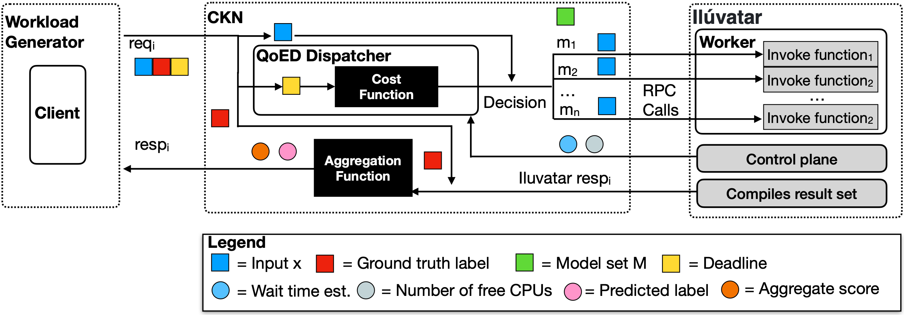

#  MODE-S  
**Model Ensemble Selection for Serverless Edge Inference**

##  Overview
This repository contains the implementation of **MODE-S**, a framework for **dynamic model ensemble selection** in **serverless edge inference environments**.  
The goal of MODE-S is to select an optimal set of deep learning models per request while satisfying **latency deadlines**, **resource constraints**, and an **accuracy proxy**.

The framework argets edge–cloud environments that host both lightweight and heavyweight models, ensuring inference requests are completed within the deadline.



---

## Key Features
-  Deadline-aware model ensemble selection  
- Cost-function–based greedy selection  
- Parallel execution of selected models  
- Accuracy proxy using model size  
- Designed for serverless edge platforms  

---

## System Architecture & Workflow

MODE-S consists of **three main components**:

- **Workload Generator**
- **CKN (Cyberinfrastructure Knowledge Network)**
- **Iluvatar (Serverless Inference Platform)**

## Request Flow

1. The **Workload Generator** acts as a client and sends inference requests with deadlines.
2. Requests are received by **CKN**, where the **QoED operator** evaluates each request.
3. The QoED operator selects an appropriate **model ensemble** using the cost function.
4. The selected inference request is forwarded to **Iluvatar** for execution.
5. **Iluvatar** executes the selected models in parallel and returns inference results to **CKN**.
6. **CKN’s aggregation function** combines the model outputs and returns the final prediction to the client.

This design enables **adaptive, deadline-aware inference** across **heterogeneous models**.

---

##  Cost Function
The selection of a model set is guided by the following cost function:
$$
C_r = \frac{T_e}{D} + \alpha \cdot \frac{\text{MaxMS}[size]}{\sum \text{bytes}_{MS}}
$$

where:
- $T_e$ is the estimated execution time of the model set
- $D$ is the request deadline
- $\alpha$ is a tunable weight
- $\text{MaxMS}[size]$ is the sum of the largest model sizes
- $\sum \text{bytes}_{MS}$ is the total size of the selected model set

---

## Models Evaluated
- MobileNetV3 (Small)  
- ResNet-18  
- ResNet-34  
- ResNet-50  
- ResNet-101  
- ViT-B/16  

---

## Dataset
- **ImageNet (ILSVRC 2012)**  
Used to evaluate latency behavior and accuracy proxy trends.

---

## Installation

Clone the repository:

```bash
git clone https://github.com/Data-to-Insight-Center/ckn-faas.git
cd ckn-faas
```

---


## How to Run 

### 1 Start Ilúvatar and get the server IP
Run **Ilúvatar** (your serverless inference platform) and note the server IP address or hostname where it is running.

---

### 2 Set the Ilúvatar server address in the config
Update the following configuration file:

```text
codespace/ckn_controller/ckn_config.py
```

### Set the server address
Update the server address in the configuration file:

```python
SERVER_ADDRESS = "xxx.xxx.xxx.xx:8079"
```
Replace xxx.xxx.xxx.xx with your Ilúvatar server IP.


### 3 Run the CKN service
Start the CKN service from the project root:

```bash
python ckn_service.py

```


### 4 Configure the workload generator (deadline and arrival interval)
Edit the workload generator configuration file:

```text
codespace/workload_generator/generator.py
```
Update the following parameters as needed:

```python
default_deadline_ms = 500
default_air_ms = 100

```


### 5 Run the workload generator
Navigate to the workload generator entry point:

```text
codespace/workload_generator/main
```
Run the workload generator:

```bash
python main.py
```